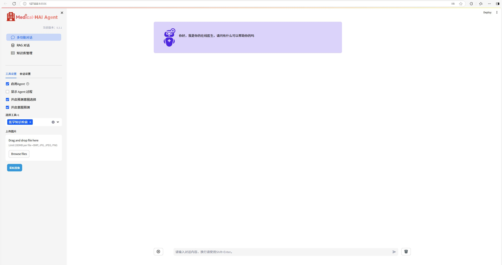

## Quick Start

1. First, you need to install our main system as a library, please execute:

```plain
pip install git+https://github.com/yourusername/chatchat.git 
```

2. Execute initialization:

```yaml
cd Medical_HAI
chatchat init
```

3. Configure parameter files:

+ **Configure the model (model_settings.yaml)** It is recommended to use glm4 plus apikey.

```yaml
api_key: YOUR_GLM4_PLUS_API_KEY
```

+ **Configure basic parameters (basic_settings.yaml)**

```yaml
# Default storage path for the knowledge base
KB_ROOT_PATH: {your_project_path}\data\knowledge_base

# Default storage path for the database. If using sqlite, you can directly modify DB_ROOT_PATH; if using other databases, please directly modify SQLALCHEMY_DATABASE_URI.
DB_ROOT_PATH: {your_project_path}\data\knowledge_base\info.db

# Connection URI for the knowledge base information database
SQLALCHEMY_DATABASE_URI: sqlite:///{your_project_path}\data\knowledge_base\info.db
```

+ Configure your bing_search_v7 api key **(basic_settings.yaml)**

You need to register for an official Bing bing_search_v7 service.

```yaml
DEFAULT_BING_SEARCH_API_KEY:
```

5. Start the project:

```yaml
chatchat start -a
```

6. In the UI interface, check to enable the agent to start intent prediction and intent prediction selection to experience system 1.


